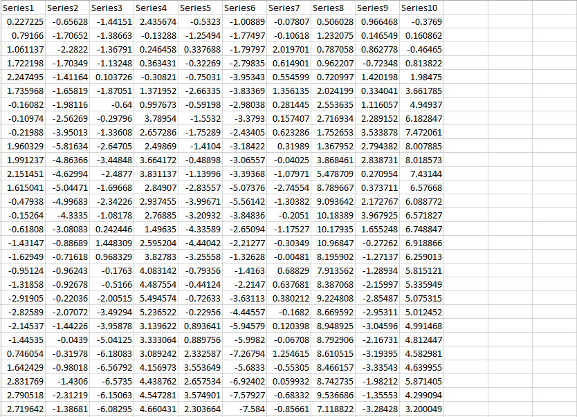
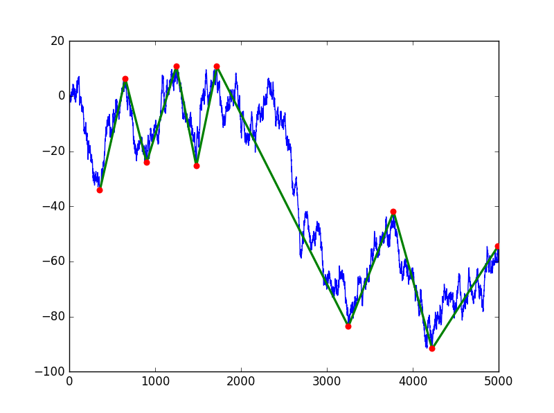
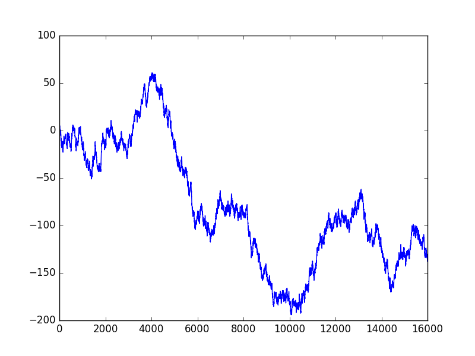
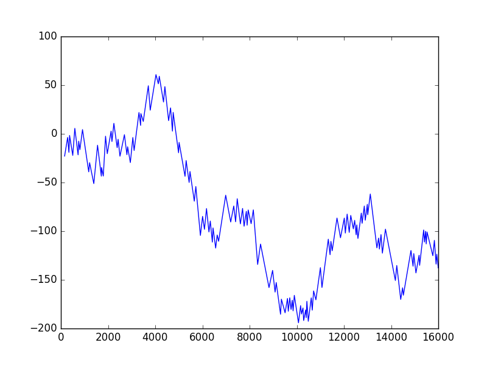
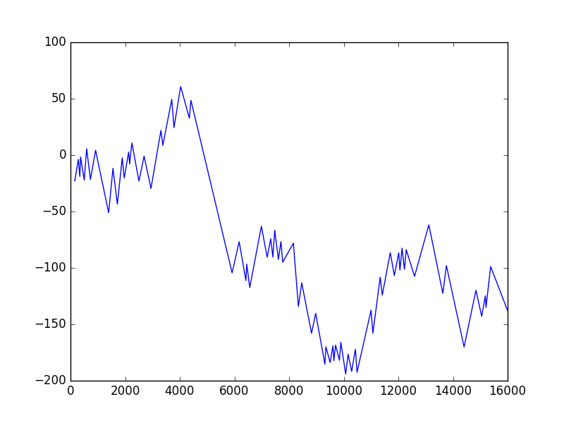
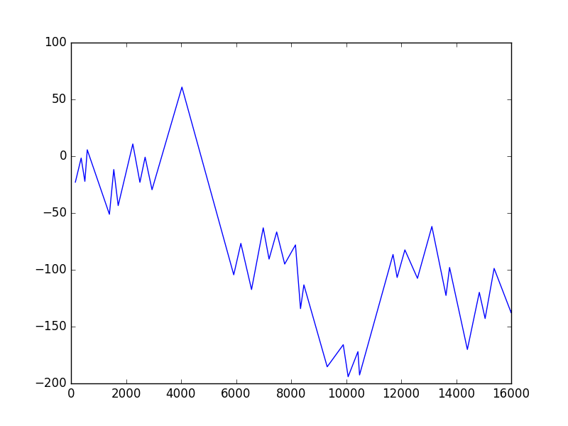

# CycleDating

Prerequisites: 

Python 3, and pip package manager. Dependencies are Numpy, matplotlib and pandas. However, these should be installed automatically via the install command below.

Install:

```
pip install cycle_dating
```

Example usage:

```
from cycle_dating.Algos import eiisr
from cycle_dating.Utilities import series, use_data

generate_random = True

if generate_random:
"""
we can generate a random time series, based on a random walk process
"""
series_obj = series.Series(series_len=10000)
else:
"""
We could also use real data. The file 'test_data.csv' is in the same directory as this script, for example.
Multiple time series can be imported from the same data file (an example of such a file is shown below this code sample). 
Here, the first time series in the data file is used (hence the zero index).
"""
series_obj = use_data.make_series_basic("test_data.csv")[0]

eiisr_obj = eiisr.EIISR(dim=20)
eiisr_obj.set_data(series_obj)
pos, fitness = eiisr_obj.optimise()
use_data.plot_solution(series_obj, pos, linewidth=2, scatter=True, scatter_size=12)
```

Example of an appropriate data file is shown below. Note that each time series must have its own column.

<p align="center">

</p>

## Background

Algorithms designed to optimise the following problem, were developed in the MSc thesis:

Maximise

<p align="center">

</p>

subject to

<p align="center">

</p>

An optimal solution to the problem above can be interpreted as optimal times to buy and sell a given asset, disregarding transaction costs. Cycles of buy-sell times are therefore found. An example is shown below, where red dots represent the near-optimal buy-sell points found.

<p align="center">

</p>


A final solution also has the ability to effectively represent a time series with much less observations than the original time series. Consider a time series of 16000 observations:

<p align="center">

</p>

Now, if we extract 160 buy-sell points, and represent the time series only with those 160 points:

<p align="center">

</p>

Represented with 80 points:

<p align="center">

</p>

Represented with 40 points:

<p align="center">

</p>

Represented with 10 points:

<p align="center">

</p>

One therefore has the choice to represent the time series at varying compression rates. This may be seen as an alternative way to compress time series, than those given in Keogh et al. (2004), for example.

A short description of each algorithm is given below.

### BSA-Extrema Importance Identity sequence retrieval (BSA-EIISR)

This is based on the EIISR algorithm introduced by Wu and Huang (2009). It first finds candidate observations that may be used as troughs, then finds optimal peaks, given those troughs, via a simpler procedure.

### Stochastic Generation and Adaptation method  (SGA)

This method finds optimal points via a coordinate ascent approach. Very fast, but often gives more sub-optimal solutions.

### Particle Swarm Optimisation (PSO)

A stochastic search method based on swarm behaviour of animals. Was used as a benchmark in the thesis. It did not perform as well as the other algorithms. For an excellent introduction to the PSO algorithm and some of its variants, please consult Engelbrecht (2007).

### BSA-Bottom-up  (BSA-BU)

This method works similarly to the bottom-up method presented in Keogh et al. All peaks and troughs are initially assumed to be buy-sell points, and are eliminated based on how little they contribute to a high value for the objective function.

### Hierarchical method

A method presented by my supervisor, in Litvine (2016). Also used for comparison. Was outperformed by BSA-EIISR, BSA-BU and SGA.

## References:

Engelbrecht, A. P. (2007). Computational Intelligence: An Introduction (2nd ed). Chichester,
England: Wiley. ISBN: 978-0-470-03561-0.

Keogh, E. et al. (2004). "Segmenting time series: a survey and novel approach". In: Data
mining in Time Series Databases. Ed. by M. Last, A. Kandel, and H. Bunke. World
Scientific Publishing Company, pp. 1-21. ISBN: 978-981-4486-54-5.

Igor Nikolaevich Litvine (2016).   Economic  and  Financial  Cycles  in  South  Africa.   Economies  and
finances.  Universit ́e de Lorraine.  English.

Wu, X. and Huang, D. (2009). "Representing Financial time series based on important
extrema points". In: Intelligent Information Technology Application, 2009. IITA 2009.
Third International Symposium on Intelligent Information Technology Applications. (Nanchang,
China). Ed. by Q. Luo and M. Zhu. Vol. 1. The Institute of Electrical and Electronics
Engineers, Inc., pp. 501-504. ISBN: 978-0-7695-3859-4.
